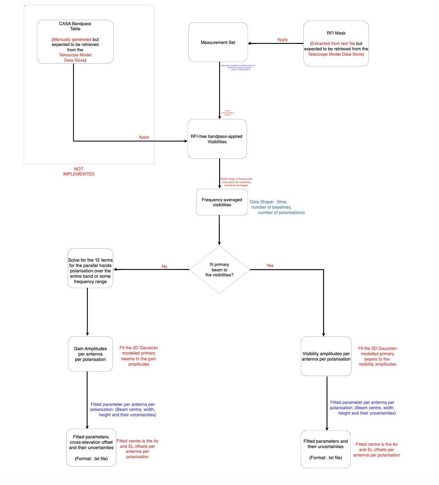

SKA SDP Pointing Offset Calibration Pipeline
============================================
This is a `repository`_ for the SDP pointing offset calibration pipeline. This repository reads measurement set,
optionally applies an RFI mask and/or select some frequency range of interest, and then fits the primary beams
(modelled by a 2D Gaussian) of the parallel hands to their visibility or gain amplitudes. The fitted parameters
are the Gaussian centre (provides the Azimuth-Elevation offsets), width (the fitted beamwidth), and height. These
offsets and the cross-elevation offsets are then optionally written to a text file for further analysis. The
pipeline reads measurement set using the Visibility class in `ska-sdp-datamodels`_. When an RFI mask is applied
and/or some frequency range is selected, the modified visibility is created with the `ska-sdp-datamodels`_
Visibility class for gain calibration (G terms) or provides easy access to the visibilities and their associated
parameters when fitting to them. These gains of each antenna are solved for using the gain solver in the
`ska-sdp-func-python`_ library. The primary beam modelling and fitting is performed with `scikits.fitting`_
following the procedure used by the `SARAO`_ team for computing the pointing offsets for the MeerKAT array.

The current pipeline can be executed as a CLI-based command line app.
Please check the `pointing_offset_cli`_ page for usage instructions.

Installation Instructions
=========================
The package is installable via pip.

If you would like to view the source code or install from git, use::

  git clone https://gitlab.com/ska-telescope/sdp/science-pipeline-workflows/ska-sdp-wflow-pointing-offset.git
    
Please ensure you have all the dependency packages installed. The installation is managed through `poetry`_. Refer to their
page for instructions.

.. toctree::
   :maxdepth: 1

   api/index

.. toctree::
   :maxdepth: 1
   :caption: Contents:

Indices and tables
==================

* :ref:`genindex`
* :ref:`modindex`
* :ref:`search`

.. _repository: https://gitlab.com/ska-telescope/sdp/science-pipeline-workflows/ska-sdp-wflow-pointing-offset
.. _ska-sdp-datamodels: https://gitlab.com/ska-telescope/sdp/ska-sdp-datamodels
.. _ska-sdp-func-python: https://gitlab.com/ska-telescope/sdp/ska-sdp-func-python
.. _scikits.fitting: https://pypi.org/project/scikits.fitting/
.. _SARAO: https://www.sarao.ac.za/
.. _pointing_offset_cli: https://developer.skao.int/projects/ska-sdp-wflow-pointing-offset/en/latest/api/ska_sdp_wflow_pointing_offset/pointing_offset_cli.html
.. _poetry: https://python-poetry.org/docs/

